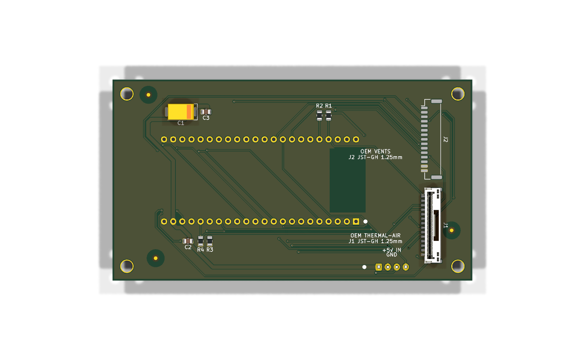
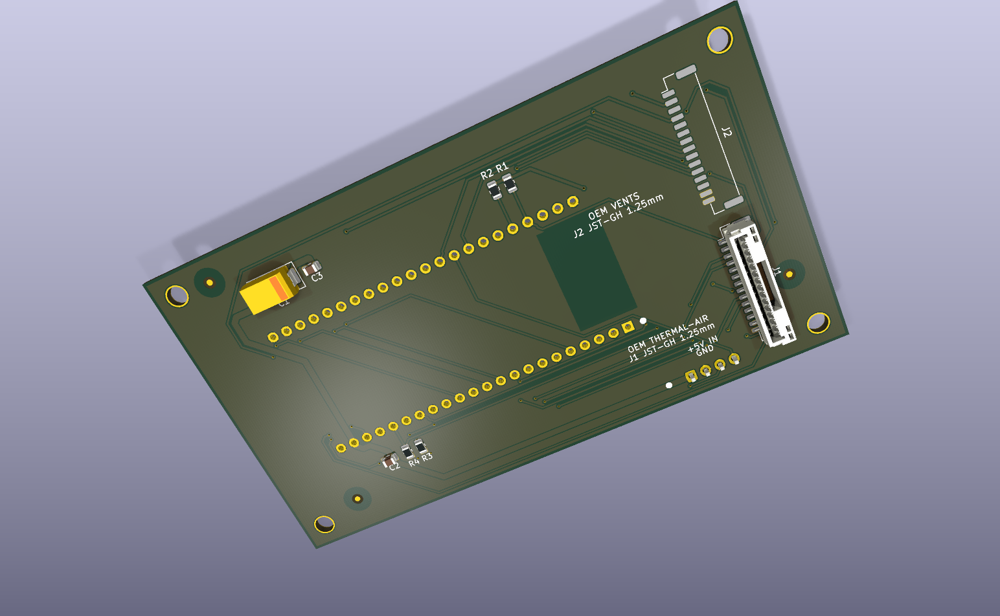

# SH03 controller

SH03 controller is an ESP32-S3-DevKitC-1 carrier board for the Sovol SH03
filament dryer. The board is a two-layer, 100 × 56 mm design. It carries nine
back-side SMD references: J1, J2, R1-R4, and C1-C3. J3 and the DevKitC-1
headers are through-hole parts fitted by the builder.

This repository contains the KiCad source, custom footprints, schematic
exports, fabrication files, renders, validation reports, and regeneration
scripts. The current design is Rev-A.

## Validation status

The repository documents CAD, DRC/ERC, routing, placement, and fabrication
checks. The project author has personally validated correct operation of the
assembled Rev-A board in the dryer. Perform the checks in
[docs/bring-up.md](docs/bring-up.md) before connecting a board to a dryer.

No firmware is included. The GPIO assignments are documented in
[docs/gpio-remap.md](docs/gpio-remap.md).

## Fabrication

The upload package is in [fab/](fab/). Read [fab/README.md](fab/README.md)
before ordering. The package contains Gerbers, a BOM, a CPL, and a STEP
export.

The BOM and sourcing notes are in [docs/bom.md](docs/bom.md). Connector mate
compatibility and all order-time sourcing information require confirmation
before an order.

## Images

[](renders/sh03-controller-bottom.png)
[](renders/sh03-controller-angled.png)

The angled render does not include a resolved J2 3D model.

## Toolchain

The source was generated and checked with KiCad 10.0.5. The scripts use the
standalone `pcbnew` Python module. The fab guide includes the `kicad-cli`
commands for Gerbers, drills, CPL, SVG, 3D renders, and schematic PDF export.

The board generation pipeline is documented in
[docs/layout-plan.md](docs/layout-plan.md):

```text
scripts/place_footprints.py
scripts/route_board.py
scripts/add_ground_pour.py
scripts/add_fiducials.py
```

Run `scripts/check_placement.py`, `scripts/report_pads.py`, and
`scripts/check_determinism.py` after regeneration.

## Licensing

Hardware and documentation are covered by [CERN-OHL-P-2.0](LICENSE).
Scripts are covered by [MIT](LICENSES/MIT.txt). See [NOTICE.md](NOTICE.md) for
third-party and KiCad-derived footprint exceptions.
